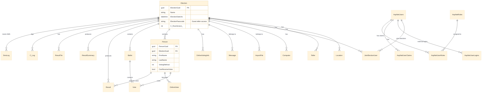

# Technical Specification: Complete TallyJ Reverse Engineering Documentation (Tasks 6-11)

## 1. Technical Context

### 1.1 Project Overview
This specification defines the implementation approach for completing the remaining documentation tasks (6-11) for the TallyJ election system reverse engineering project.

**Current Status**:
- **Completed**: Tasks 1-5 (~55,000 lines of documentation)
- **Remaining**: Tasks 6-11 (configuration, integrations, ERD, architecture, handoff, review)

**Documentation Location**: `.zenflow/tasks/reverse-engineer-and-design-new-cd6a/`

### 1.2 Technology Stack (Analysis Environment)
- **Tools**: File system analysis, text parsing, Mermaid diagram generation
- **Languages**: Markdown, Mermaid (for ERD)
- **Source Format**: XML (Web.config), C# source files
- **Output Format**: Markdown documentation

### 1.3 Key Assumptions
- **Source code location**: `C:\Dev\TallyJ\v3\Site` (if not accessible, work with existing documentation)
- **Documentation completeness**: Tasks 1-5 documentation is accurate and complete
- **No implementation**: This is documentation-only work, no actual system building

---

## 2. Implementation Approach

### 2.1 Overall Strategy
Complete the documentation in the order specified in requirements.md:
1. Extract and document configuration (Task 6)
2. Document external integrations (Task 7)
3. Generate visual ERD (Task 8)
4. Create migration architecture synthesis (Task 9)
5. Create handoff/summary document (Task 10)
6. Review and validate all documentation (Task 11)

### 2.2 Source Code Access Strategy
If source code at `C:\Dev\TallyJ\v3\Site` is **not accessible**:
- Work from existing documentation in `.zenflow/tasks/reverse-engineer-and-design-new-cd6a/`
- Extract configuration details from spec.md and existing docs
- Create reasonable configuration documentation based on typical ASP.NET patterns
- Document this limitation in Task 11 review

If source code **is accessible**:
- Read and analyze `Web.config` and related configuration files
- Cross-reference with existing documentation
- Extract actual configuration values (sanitizing secrets)

---

## 3. Detailed Implementation Plan by Task

### 3.1 Task 6: Document Configuration Settings

**Input Files**:
- `C:\Dev\TallyJ\v3\Site\Web.config` (if accessible)
- `C:\Dev\TallyJ\v3\Site\AppDataSample\AppSettings.config` (if accessible)
- Existing documentation in `.zenflow/tasks/reverse-engineer-and-design-new-cd6a/spec.md`

**Output File**: `.zenflow/tasks/reverse-engineer-and-design-new-cd6a/configuration/settings.md`

**Structure**:
```markdown
# TallyJ Configuration Settings Documentation

## 1. Overview
- Configuration file locations
- Environment-specific configurations
- External configuration files

## 2. Connection Strings
- MainConnection3 (SQL Server)
- Connection string format
- Configuration at IIS/machine level

## 3. AppSettings
### 3.1 Environment Configuration
- Environment (Dev/Prod)
- HostSite URL
- HostSupportsOnlineElections
- UseProductionFiles

### 3.2 Logging Configuration
- iftttKey (IFTTT webhook)
- LOGENTRIES_ACCOUNT_KEY
- LOGENTRIES_TOKEN
- LOGENTRIES_LOCATION

### 3.3 OAuth Configuration
- Facebook App ID/Secret
- Google Client ID/Secret
- External file reference

### 3.4 ASP.NET Configuration
- webpages:Version
- ClientValidationEnabled
- UnobtrusiveJavaScriptEnabled

## 4. System.Web Configuration
### 4.1 Compilation Settings
- Debug mode
- targetFramework

### 4.2 HTTP Runtime
- maxRequestLength
- targetFramework

### 4.3 Authentication
- Mode (Forms/Windows)
- Cookie settings

### 4.4 Session State
- StateServer mode
- Server address (localhost:42424)
- Timeout (360 minutes = 6 hours)
- cookieless setting

### 4.5 Custom Errors
- Mode settings

### 4.6 MachineKey
- Configuration approach

### 4.7 Profile & Membership
- Provider configuration

## 5. Unity Dependency Injection
- Type registrations
- Lifetime management
- Interface → Implementation mappings

## 6. Entity Framework Configuration
- Provider (SQL Server)
- Connection factory
- Migration settings

## 7. SMTP Configuration
- Email server settings
- Authentication
- From address

## 8. OWIN Configuration
- AutomaticAppStartup
- Cookie authentication
- OAuth middleware

## 9. .NET Core Migration Mapping
### 9.1 Web.config → appsettings.json
- Structure transformation
- Naming conventions

### 9.2 Environment-Specific Configuration
- appsettings.Development.json
- appsettings.Production.json
- User secrets for sensitive data
- Azure Key Vault integration (optional)

### 9.3 Configuration Access
- IConfiguration interface
- Options pattern (IOptions<T>)

### 9.4 Dependency Injection Migration
- Unity → ServiceCollection
- Service lifetime equivalents

### 9.5 Session State Migration
- StateServer → Redis/SQL Server distributed cache
- Stateless JWT approach (alternative)

## 10. Security Considerations
- Secret management
- Connection string security
- OAuth credential storage
```

**Implementation Steps**:
1. Create `configuration/` directory if needed
2. If source files accessible: Read and parse Web.config
3. If source files not accessible: Extract from existing spec.md and make informed assumptions
4. Document each configuration section with:
   - Current value/structure
   - Purpose/usage
   - .NET Core equivalent
   - Migration notes
5. Sanitize any actual secrets/keys (replace with placeholders)

---

### 3.2 Task 7: Document External Integrations

**Input Sources**:
- Existing documentation (spec.md, authentication.md, tally-algorithms.md)
- Web.config (if accessible)
- Controller analysis from api/controllers/*.md

**Output Files**:
- `.zenflow/tasks/reverse-engineer-and-design-new-cd6a/integrations/oauth.md`
- `.zenflow/tasks/reverse-engineer-and-design-new-cd6a/integrations/sms.md`
- `.zenflow/tasks/reverse-engineer-and-design-new-cd6a/integrations/email.md`
- `.zenflow/tasks/reverse-engineer-and-design-new-cd6a/integrations/logging.md`

**Structure for oauth.md**:
```markdown
# OAuth Authentication Integration

## 1. Overview
- Google OAuth 2.0
- Facebook OAuth
- Usage in Admin authentication system

## 2. Google OAuth 2.0
### 2.1 Configuration
- Client ID (from AppSettings/external config)
- Client secret
- Callback URL structure

### 2.2 Scopes Requested
- Profile information
- Email address

### 2.3 User Claims Mapping
- External ID → AspNetUserLogins
- Email → User profile
- Name → Display name

### 2.4 Implementation in ASP.NET Framework
- OWIN OAuth middleware
- ExternalLoginCallback handling
- Account linking workflow

### 2.5 .NET Core Migration
- Microsoft.AspNetCore.Authentication.Google
- Microsoft.AspNetCore.Authentication.Facebook
- Configuration in Startup.cs / Program.cs
- ExternalLogin workflow changes
- IdentityServer integration (if needed)

## 3. Facebook OAuth
[Similar structure to Google]

## 4. Security Considerations
- State parameter validation
- CSRF protection
- Token handling

## 5. User Experience Flow
- Login page flow
- Account creation vs. linking
- Disconnecting external accounts

## 6. Error Handling
- OAuth failure scenarios
- Network errors
- Invalid credentials
```

**Structure for sms.md**:
```markdown
# Twilio SMS Integration

## 1. Overview
- Purpose: Voter phone number verification
- Provider: Twilio
- Usage: One-time 6-digit verification codes

## 2. Configuration
### 2.1 Twilio Settings
- Account SID (location in config)
- Auth Token (secure storage)
- From phone number

### 2.2 Configuration Keys
- AppSettings or external config file

## 3. Implementation
### 3.1 Code Generation
- 6-digit numeric code generation
- Code storage (OnlineVotingInfo table)
- Code expiration (time-based)

### 3.2 SMS Sending
- Twilio API calls
- Message templates
- Error handling

### 3.3 Code Verification
- Voter enters code
- Code validation logic
- Retry limits

## 4. Rate Limiting
- Per-phone-number limits
- Cost management
- Abuse prevention

## 5. Error Handling
- SMS delivery failures
- Invalid phone numbers
- Network errors
- Twilio API errors

## 6. Cost Considerations
- Per-SMS pricing
- Monthly budget tracking
- Alternative: Email codes

## 7. .NET Core Migration
- Twilio SDK NuGet package (same for Core)
- Async/await patterns
- IOptions<TwilioSettings> configuration
- Dependency injection

## 8. Testing Strategy
- Twilio test credentials
- Mock SMS service for development
```

**Structure for email.md**:
```markdown
# Email Service Integration

## 1. Overview
- Purpose: Election notifications, voter verification codes
- Protocol: SMTP
- Current implementation: System.Net.Mail

## 2. Configuration
### 2.1 SMTP Settings
- Host
- Port
- EnableSSL
- Credentials (username, password)
- From address

### 2.2 Configuration Location
- Web.config <system.net><mailSettings>

## 3. Email Templates
### 3.1 Voter Invitation
- Template content
- Personalization fields

### 3.2 Verification Code
- 6-digit code delivery
- Alternative to SMS

### 3.3 Election Results
- Admin notifications
- Result summaries

### 3.4 Teller Invitations
- Access code delivery

## 4. Implementation
- SmtpClient usage
- Email composition
- Attachment handling (if any)

## 5. Error Handling
- SMTP connection failures
- Authentication errors
- Invalid email addresses
- Retry logic

## 6. .NET Core Migration
### 6.1 MailKit (recommended)
- MailKit + MimeKit NuGet packages
- Modern SMTP client
- Async support

### 6.2 SendGrid (alternative)
- Cloud email service
- Better deliverability
- API-based (not SMTP)

### 6.3 Configuration
- IOptions<EmailSettings>
- Secure credential storage

## 7. Testing
- Development: Papercut SMTP / MailHog
- Staging: Test email addresses
```

**Structure for logging.md**:
```markdown
# Logging Integrations

## 1. Overview
- LogEntries (cloud logging platform)
- IFTTT (high-level event notifications)

## 2. LogEntries Integration
### 2.1 Purpose
- Centralized application logging
- Error tracking
- Performance monitoring

### 2.2 Configuration
- LOGENTRIES_ACCOUNT_KEY
- LOGENTRIES_TOKEN
- LOGENTRIES_LOCATION

### 2.3 Log Levels
- Error
- Warning
- Info
- Debug

### 2.4 Log Categories
- Application errors
- Authentication events
- Tally operations
- SignalR connections

### 2.5 Implementation
- NuGet package used
- Logger integration
- Structured logging

### 2.6 .NET Core Migration
- Serilog with LogEntries sink
- ILogger<T> integration
- Configuration in appsettings.json
- Structured logging with properties

## 3. IFTTT Integration
### 3.1 Purpose
- High-level event notifications
- Admin alerts
- External automation

### 3.2 Configuration
- iftttKey (webhook key)

### 3.3 Events Logged
- Election created
- Tally completed
- Critical errors
- System health events

### 3.4 Implementation
- HTTP POST to IFTTT webhook
- JSON payload structure
- Async calls (fire-and-forget)

### 3.5 .NET Core Migration
- HttpClient for webhook calls
- IHttpClientFactory
- Retry policies with Polly

## 4. Other Logging
### 4.1 File-Based Logging
- C_Log table
- Local log files (if any)

### 4.2 Database Logging
- Message table (user-facing messages)
- SmsLog table (SMS tracking)

## 5. .NET Core Logging Strategy
### 5.1 Recommended Stack
- Serilog (structured logging)
- Multiple sinks:
  - LogEntries
  - Application Insights (if Azure)
  - File (development)
  - Console (development/container)

### 5.2 Configuration
- Log levels per environment
- Sensitive data filtering
- Performance considerations
```

**Implementation Steps**:
1. Create `integrations/` directory
2. Extract integration details from existing documentation
3. Research standard integration patterns for each service
4. Document current implementation based on existing docs
5. Provide .NET Core migration guidance
6. Include code examples where helpful

---

### 3.3 Task 8: Generate Database ERD

**Input**: `.zenflow/tasks/reverse-engineer-and-design-new-cd6a/database/entities.md`

**Output**: `.zenflow/tasks/reverse-engineer-and-design-new-cd6a/database/erd.mmd`

**Mermaid ERD Structure**:


**Implementation Steps**:
1. Read `database/entities.md` to extract:
   - All entity names (16 core + 4 identity tables)
   - Primary keys
   - Foreign keys (relationships)
   - Key attributes
2. Create Mermaid ERD with:
   - All entities as boxes
   - Relationships with cardinality (||--o{, ||--||, }o--o{)
   - Key attributes listed
3. Use comments to indicate functional areas
4. Test rendering with Mermaid Live Editor
5. Ensure diagram is readable (not too cluttered)
6. Add legend for relationship types

**Alternative Approach**: If single ERD is too complex, create multiple ERDs:
- `erd-overview.mmd` (simplified, key entities only)
- `erd-election-management.mmd`
- `erd-voting.mmd`
- `erd-results.mmd`
- `erd-identity.mmd`

---

### 3.4 Task 9: Create Migration Architecture Document

**Inputs**:
- All existing documentation in `.zenflow/tasks/reverse-engineer-and-design-new-cd6a/`
- spec.md (contains 9-phase migration plan)

**Output**: `.zenflow/tasks/reverse-engineer-and-design-new-cd6a/migration/architecture.md`

**Structure**:
```markdown
# TallyJ Migration Architecture

## 1. Executive Summary
### 1.1 System Overview
- Purpose: Bahá'í election system
- Key capabilities
- User types (Admin, Guest Teller, Voter)

### 1.2 Current State
- ASP.NET Framework 4.8
- Technology stack summary
- Deployment model
- Known limitations

### 1.3 Target State
- .NET Core 8 + Vue 3
- Technology stack summary
- Architecture improvements
- Expected benefits

### 1.4 Migration Rationale
- Framework EOL concerns
- Performance improvements
- Modern development experience
- Cross-platform support
- Security updates

### 1.5 Success Criteria
- Functional parity
- Tally algorithm accuracy (100% match)
- Performance improvements
- Security hardening
- Maintainability improvements

## 2. Current vs. Target Architecture

### 2.1 Architecture Comparison Table
| Aspect | Current (Framework 4.8) | Target (.NET Core 8) |
|--------|-------------------------|----------------------|
| Architecture | MVC Monolith | SPA + API Backend |
| Frontend | Razor + jQuery + Vue 2 | Vue 3 SPA |
| Backend | ASP.NET MVC | ASP.NET Core API |
| ORM | Entity Framework 6 | EF Core 8 |
| DI | Unity | Built-in ServiceCollection |
| Auth | ASP.NET Identity 2.x | ASP.NET Core Identity + JWT |
| Real-time | SignalR 2.4.3 | SignalR Core |
| Session | StateServer (TCP) | Redis / JWT stateless |
| Deployment | IIS + Windows | Docker + Linux/Windows |

### 2.2 Technology Stack Mapping
[Detailed table from spec.md]

### 2.3 Architecture Pattern Changes
- Monolith → SPA architecture
- Server-rendered views → Client-side rendering
- Stateful sessions → Stateless JWT (or distributed cache)
- Per-view assets → Component-based SFC

### 2.4 Deployment Model Changes
- IIS-only → Docker containers
- Windows Server → Linux/Windows
- Manual deployment → CI/CD pipeline
- Single server → Scalable architecture

## 3. Migration Strategy Overview

### 3.1 Migration Phases (Summary)
[Reference to 9 phases from spec.md]
1. Foundation & Infrastructure Setup
2. Database Migration (EF6 → EF Core)
3. API Development (Controllers → API endpoints)
4. Authentication & Authorization
5. SignalR Migration
6. Business Logic & Tally Algorithms
7. Frontend Development (Vue 3 SPA)
8. Integration & Testing
9. Deployment & Cutover

### 3.2 Critical Path Items
- Database migration (all phases depend on this)
- Authentication systems (3 independent systems)
- Tally algorithm migration (highest risk)
- SignalR hub migration (real-time dependencies)

### 3.3 Phase Dependencies
- Phase dependency graph
- Blocking relationships
- Parallel work opportunities

### 3.4 Estimated Timeline
- Total: 24 weeks (from spec.md)
- Phase breakdown
- Resource requirements

## 4. Component Migration Mapping

### 4.1 Backend Component Mapping
#### Controllers → API Endpoints
- 12 Controllers → 12 API Controllers
- ActionResult → IActionResult / ActionResult<T>
- JsonResult → Typed responses
- View returns → Removed (SPA handles views)

#### Entity Framework Migration
- DbContext → DbContext (EF Core)
- Migrations (EF6 → EF Core format)
- LINQ queries (mostly compatible)
- Lazy loading (explicit opt-in in Core)

#### Dependency Injection
- Unity container → ServiceCollection
- RegisterType → services.AddScoped/AddSingleton/AddTransient
- Lifetime mapping

#### SignalR Hubs
- Hub → Hub<T> (strongly-typed)
- Context.ConnectionId → same
- Groups → same API
- 10 hubs → 5-10 hubs (consolidation opportunity)

### 4.2 Frontend Component Mapping
#### Razor Views → Vue Components
- .cshtml files → .vue SFC files
- View-specific .js → <script setup>
- LESS → CSS Modules / Tailwind

#### State Management
- Server sessions → Pinia stores
- ViewBag → Component props / stores

#### Routing
- Server-side routing → Vue Router 4

#### Asset Management
- Per-view assets → Vite bundling

### 4.3 Security Component Mapping
- ASP.NET Identity → ASP.NET Core Identity
- FluentSecurity → Policy-based authorization
- Cookie auth → JWT + refresh tokens
- 3 authentication systems preserved

## 5. Critical Components Deep Dive

### 5.1 Three Authentication Systems
[Link to security/authentication.md]
- Admin authentication (password + OAuth)
- Guest Teller authentication (access code only)
- Voter authentication (one-time codes, passwordless)
- Migration approach for each

### 5.2 Tally Algorithms
[Link to business-logic/tally-algorithms.md]
- Vote counting algorithm
- Tie detection
- Result ranking
- 100% accuracy requirement
- Comparison testing strategy

### 5.3 SignalR Real-Time Architecture
[Link to signalr/hubs-overview.md]
- 10 hubs with dual-class pattern
- Connection groups strategy
- Per-election isolation
- Broadcasting patterns
- Migration to strongly-typed hubs

### 5.4 Database Schema
[Link to database/entities.md and database/erd.mmd]
- 16 core entities
- Entity relationships
- Migration considerations
- Index strategies

## 6. Risk Assessment & Mitigation

### 6.1 High-Risk Areas

#### 6.1.1 Tally Algorithm Accuracy
**Risk**: Incorrect vote counting produces wrong election results
**Impact**: Critical - election integrity
**Likelihood**: Medium (complex algorithm)
**Mitigation**:
- Comparison testing with current system
- Side-by-side tallies with same ballot data
- Unit tests for all edge cases
- Regression test suite

#### 6.1.2 Authentication System Complexity
**Risk**: Three independent auth systems may be incorrectly implemented
**Impact**: High - security & access control
**Likelihood**: Medium
**Mitigation**:
- Comprehensive documentation (authentication.md)
- Integration tests for each system
- Security audit
- Gradual rollout with pilot elections

#### 6.1.3 Real-Time Communication (SignalR)
**Risk**: Connection issues or message loss during elections
**Impact**: High - live election disruption
**Likelihood**: Low-Medium
**Mitigation**:
- Load testing with multiple connections
- Connection retry logic
- Fallback polling mechanism
- Comprehensive error handling

#### 6.1.4 Data Migration
**Risk**: Data loss or corruption during database migration
**Impact**: Critical
**Likelihood**: Low (if tested properly)
**Mitigation**:
- Full database backup before migration
- Migration script testing on copies
- Data validation after migration
- Rollback plan

#### 6.1.5 Performance Regression
**Risk**: New system is slower than current system
**Impact**: Medium - user experience
**Likelihood**: Low (.NET Core is generally faster)
**Mitigation**:
- Performance benchmarking
- Load testing
- Profiling tools
- Optimization phase

### 6.2 Testing Strategy

#### 6.2.1 Comparison Testing
- Run identical elections in both systems
- Compare results byte-by-byte
- Verify all tally outputs match

#### 6.2.2 Unit Testing
- All business logic
- Tally algorithms
- Authentication flows
- Database operations

#### 6.2.3 Integration Testing
- API endpoints
- SignalR hubs
- External integrations (SMS, email, OAuth)

#### 6.2.4 End-to-End Testing
- Complete election workflows
- All user types
- All election modes (in-person, online, hybrid)

#### 6.2.5 Load Testing
- Multiple concurrent elections
- Many concurrent users per election
- SignalR connection stress testing

### 6.3 Rollback Plans

#### 6.3.1 Pre-Migration
- Full system backup (database + application)
- Documented rollback procedure
- Test rollback process

#### 6.3.2 Phased Rollout
- Pilot elections with new system
- Parallel systems during transition
- Gradual user migration

#### 6.3.3 Rollback Triggers
- Critical bugs discovered
- Performance issues
- Security vulnerabilities
- Data integrity problems

## 7. Implementation Checklist

### Phase 1: Foundation & Infrastructure Setup
- [ ] Create .NET Core 8 project structure
- [ ] Configure dependency injection
- [ ] Set up configuration system (appsettings.json)
- [ ] Configure logging (Serilog + LogEntries)
- [ ] Set up development environment
- [ ] Configure CI/CD pipeline (GitHub Actions)
- [ ] Set up Docker containers
- **Verification**: Build succeeds, basic health check endpoint works

### Phase 2: Database Migration
- [ ] Install EF Core 8 packages
- [ ] Convert all 16 entities to EF Core
- [ ] Convert DbContext to EF Core
- [ ] Regenerate migrations
- [ ] Test against existing database
- [ ] Verify all queries work
- **Verification**: All entities accessible, relationships intact, unit tests pass

### Phase 3: API Development
- [ ] Convert 12 Controllers to API Controllers
- [ ] Remove View returns, convert to JSON
- [ ] Create DTOs for all responses
- [ ] Implement error handling middleware
- [ ] Add API versioning
- [ ] Generate OpenAPI/Swagger documentation
- **Verification**: All endpoints accessible, integration tests pass

### Phase 4: Authentication & Authorization
- [ ] Implement ASP.NET Core Identity
- [ ] Admin authentication (JWT + OAuth)
- [ ] Guest Teller authentication (access code)
- [ ] Voter authentication (passwordless codes)
- [ ] Policy-based authorization
- [ ] Test all three systems independently
- **Verification**: All auth flows work, security tests pass

### Phase 5: SignalR Migration
- [ ] Install Microsoft.AspNetCore.SignalR
- [ ] Migrate all 10 hubs to SignalR Core
- [ ] Implement strongly-typed hubs
- [ ] Test connection groups
- [ ] Test broadcasting
- **Verification**: Real-time updates work, connection tests pass

### Phase 6: Business Logic & Tally Algorithms
- [ ] Port tally algorithm
- [ ] Port tie detection
- [ ] Port ballot validation
- [ ] Implement progress reporting
- [ ] Unit test all edge cases
- [ ] Comparison test with current system
- **Verification**: Tally results match current system 100%

### Phase 7: Frontend Development
- [ ] Create Vue 3 project with Vite
- [ ] Set up Pinia stores
- [ ] Set up Vue Router
- [ ] Convert all views to Vue components
- [ ] Implement SignalR client
- [ ] Implement authentication flows
- [ ] Style with Tailwind/Element Plus
- **Verification**: All pages functional, E2E tests pass

### Phase 8: Integration & Testing
- [ ] Integration testing (API + frontend)
- [ ] End-to-end testing (full workflows)
- [ ] Load testing (performance)
- [ ] Security testing (pen testing)
- [ ] Accessibility testing
- [ ] Browser compatibility testing
- **Verification**: All tests pass, performance acceptable

### Phase 9: Deployment & Cutover
- [ ] Production environment setup
- [ ] Database migration (production data)
- [ ] Configuration (production secrets)
- [ ] Pilot elections
- [ ] Gradual rollout
- [ ] Monitor and fix issues
- [ ] Full cutover
- **Verification**: Production system stable, users satisfied

## 8. Documentation Index

### 8.1 All Documentation Files
- `api/endpoints.md` - All API endpoints
- `api/controllers/*.md` - Controller-specific documentation (12 files)
- `database/entities.md` - All 16 entities + relationships
- `database/erd.mmd` - Visual ERD
- `security/authentication.md` - 3 authentication systems
- `security/authorization.md` - Authorization rules
- `signalr/hubs-overview.md` - All 10 SignalR hubs
- `business-logic/tally-algorithms.md` - Tally algorithms
- `configuration/settings.md` - Configuration documentation
- `integrations/oauth.md` - OAuth integration
- `integrations/sms.md` - Twilio SMS integration
- `integrations/email.md` - Email integration
- `integrations/logging.md` - Logging integrations
- `migration/architecture.md` - This document
- `ui-screenshots-analysis.md` - UI analysis
- `spec.md` - Technical specification
- `requirements.md` - Original requirements
- `REVERSE-ENGINEERING-SUMMARY.md` - Summary
- `DOCUMENTATION-INDEX.md` - Documentation catalog

### 8.2 Recommended Reading Order

#### For Project Managers / Stakeholders
1. `REVERSE-ENGINEERING-SUMMARY.md` - Overview
2. `migration/architecture.md` (sections 1-3) - Strategy
3. `spec.md` (timeline section) - Schedule

#### For Backend Developers
1. `migration/architecture.md` - Full architecture
2. `database/entities.md` - Database schema
3. `api/endpoints.md` - API overview
4. `security/authentication.md` - Auth systems
5. `business-logic/tally-algorithms.md` - Core algorithms
6. `signalr/hubs-overview.md` - Real-time communication

#### For Frontend Developers
1. `migration/architecture.md` (sections 1-4) - Context
2. `ui-screenshots-analysis.md` - UI requirements
3. `api/endpoints.md` - API contracts
4. `signalr/hubs-overview.md` (client sections) - Real-time client

#### For DevOps Engineers
1. `configuration/settings.md` - Configuration
2. `integrations/*.md` - External services
3. `spec.md` (infrastructure sections) - Deployment
4. `migration/architecture.md` (section 7) - Implementation

### 8.3 Quick Reference Guide

#### Authentication Quick Reference
- **Admin**: Username/password + OAuth → `security/authentication.md` section 2
- **Guest Teller**: Access code only → `security/authentication.md` section 3
- **Voter**: Email/SMS code, passwordless → `security/authentication.md` section 4

#### Database Quick Reference
- **Primary entities**: Election, Person, Ballot, Vote, Result
- **Relationships**: See `database/erd.mmd`
- **Full details**: `database/entities.md`

#### API Quick Reference
- **12 Controllers**: See `api/endpoints.md` for full list
- **Authentication required**: Most endpoints except Public*
- **Rate limiting**: Not currently documented (add in new system)

#### SignalR Quick Reference
- **10 Hubs**: See `signalr/hubs-overview.md` section 2
- **Connection strategy**: Per-election groups
- **Authentication**: Manual checks in hub methods

#### Tally Algorithm Quick Reference
- **Main algorithm**: LSA 9-member election
- **Key logic**: Vote counting, tie detection, ranking
- **Full details**: `business-logic/tally-algorithms.md`
- **Testing requirement**: 100% match with current system
```

**Implementation Steps**:
1. Create `migration/` directory
2. Synthesize information from all existing documentation
3. Create comprehensive architecture document
4. Ensure all cross-references are accurate
5. Include actionable checklists
6. Provide multiple reading paths for different roles

---

### 3.5 Task 10: Create Final Summary and Handoff Document

**Input**: All completed documentation

**Outputs**:
- Update `.zenflow/tasks/reverse-engineer-and-design-new-cd6a/REVERSE-ENGINEERING-SUMMARY.md`

**Updates Required**:
1. Mark tasks 6-11 as complete in statistics
2. Update "What Remains To Document" (should be "All documentation complete")
3. Add "How to Start Implementation" section
4. Add "AI Prompt Templates" section
5. Add "Known Gaps and Assumptions" section
6. Add "Testing Strategy" section
7. Add "Maintenance and Updates" section

**New Section: How to Start Implementation**
```markdown
## How to Start Implementation

### Step 1: Set Up Development Environment
1. Install .NET SDK 8.0 (or later)
2. Install Node.js 20+ and npm/pnpm
3. Install SQL Server or PostgreSQL
4. Install Docker Desktop (optional but recommended)
5. Install IDE: Visual Studio 2022, VS Code, or Rider
6. Install Vue DevTools browser extension

### Step 2: Create Project Structure
```bash
# Backend
dotnet new webapi -n TallyJ.Api
cd TallyJ.Api
dotnet add package Microsoft.EntityFrameworkCore.SqlServer
dotnet add package Microsoft.AspNetCore.SignalR
dotnet add package Microsoft.AspNetCore.Identity.EntityFrameworkCore
dotnet add package Serilog.AspNetCore

# Frontend
npm create vite@latest tallyj-frontend -- --template vue-ts
cd tallyj-frontend
npm install pinia vue-router axios @microsoft/signalr
npm install -D tailwindcss
```

### Step 3: Start with Database
1. Read `database/entities.md`
2. Create EF Core entity classes
3. Create DbContext
4. Configure relationships
5. Generate initial migration
6. Test against existing database (if available)

### Step 4: Implement Authentication (Critical Path)
1. Read `security/authentication.md` in full
2. Implement Admin authentication first
3. Then Guest Teller authentication
4. Finally Voter authentication
5. Test each independently

### Step 5: Implement API Layer
1. Read `api/endpoints.md`
2. Start with high-priority controllers (Setup, Elections)
3. Implement DTOs
4. Add authorization policies
5. Test with Postman/Swagger

### Step 6: Implement SignalR
1. Read `signalr/hubs-overview.md`
2. Start with MainHub
3. Test connection and groups
4. Implement remaining hubs

### Step 7: Implement Tally Algorithms (High Risk)
1. Read `business-logic/tally-algorithms.md` carefully
2. Port algorithm line-by-line
3. Create comprehensive unit tests
4. Implement comparison testing
5. Do NOT proceed until 100% match achieved

### Step 8: Build Frontend
1. Read `ui-screenshots-analysis.md`
2. Set up routing structure
3. Implement authentication flows
4. Build core components (election setup, ballot entry)
5. Integrate SignalR client
6. Style and polish

### Step 9: Integration Testing
1. Full workflow testing
2. Load testing
3. Security testing

### Step 10: Deployment
1. Create Docker containers
2. Set up CI/CD
3. Pilot elections
4. Gradual rollout
```

**New Section: AI Prompt Templates**
```markdown
## AI Prompt Templates for Implementation

### Template 1: Implement Entity
```
I need to implement the {EntityName} entity for TallyJ migration.

Context: Read the documentation at .zenflow/tasks/reverse-engineer-and-design-new-cd6a/database/entities.md, specifically the {EntityName} section.

Requirements:
1. Create EF Core entity class with all properties
2. Configure relationships using Fluent API
3. Add data annotations where appropriate
4. Include computed properties if specified
5. Match the exact schema documented

Please create the entity class and DbContext configuration.
```

### Template 2: Implement API Controller
```
I need to implement the {ControllerName} API controller for TallyJ migration.

Context: Read .zenflow/tasks/reverse-engineer-and-design-new-cd6a/api/controllers/{ControllerName}.md

Requirements:
1. Convert all action methods to API endpoints
2. Create DTOs for requests/responses
3. Implement authorization using documented rules (see security/authorization.md)
4. Add proper error handling
5. Return appropriate HTTP status codes
6. Add XML comments for Swagger

Please create the controller, DTOs, and any service classes needed.
```

### Template 3: Implement SignalR Hub
```
I need to implement the {HubName} SignalR hub for TallyJ migration.

Context: Read .zenflow/tasks/reverse-engineer-and-design-new-cd6a/signalr/hubs-overview.md, section on {HubName}.

Requirements:
1. Create strongly-typed hub (Hub<I{HubName}Client>)
2. Implement all server methods documented
3. Implement all client methods interface
4. Implement connection group management
5. Add authorization checks (manual, as documented)
6. Handle connection lifecycle events

Please create the hub class and client interface.
```

### Template 4: Implement Authentication System
```
I need to implement the {AuthSystemName} authentication system for TallyJ.

Context: Read .zenflow/tasks/reverse-engineer-and-design-new-cd6a/security/authentication.md, section {N} on {AuthSystemName}.

Requirements:
1. Implement authentication flow as documented
2. Configure ASP.NET Core Identity if needed
3. Create claims-based identity
4. Implement authorization policies
5. Add login/logout endpoints
6. Handle edge cases documented

This authentication system is INDEPENDENT from the other two systems.

Please create all necessary classes and configuration.
```

### Template 5: Implement Tally Algorithm
```
I need to implement the TallyJ tally algorithm with 100% accuracy.

Context: Read .zenflow/tasks/reverse-engineer-and-design-new-cd6a/business-logic/tally-algorithms.md IN FULL before starting.

Critical Requirements:
1. Implement vote counting algorithm exactly as documented
2. Implement tie detection logic
3. Implement result ranking algorithm
4. Handle all edge cases documented
5. Create comprehensive unit tests for all scenarios
6. Create comparison test suite to verify against current system

WARNING: This is the MOST CRITICAL component. Results must match current system 100%.

Please implement the algorithm with extensive tests.
```

### Template 6: Implement Vue Component
```
I need to implement the {ComponentName} Vue 3 component for TallyJ.

Context: Read .zenflow/tasks/reverse-engineer-and-design-new-cd6a/ui-screenshots-analysis.md for UI requirements.

Requirements:
1. Use Vue 3 Composition API with <script setup>
2. Use TypeScript
3. Implement the UI as shown in screenshots
4. Integrate with API endpoint: {endpoint}
5. Integrate with SignalR hub: {hub} (if real-time needed)
6. Use Pinia store for state management
7. Follow accessibility best practices

Please create the .vue component with all necessary imports.
```
```

**Implementation Steps**:
1. Open existing REVERSE-ENGINEERING-SUMMARY.md
2. Update statistics table (mark 6-11 complete)
3. Update "What Remains" section
4. Add new sections as specified
5. Ensure all links and cross-references work
6. Make document the ultimate "start here" guide

---

### 3.6 Task 11: Review and Validation

**Objective**: Final quality check of all documentation

**Review Checklist** (to be executed and documented):

1. **Completeness Review**
   - ✅ All 12 controllers documented → Verify file count
   - ✅ All 16 database entities documented → Verify in entities.md
   - ✅ All 10 SignalR hubs documented → Verify in hubs-overview.md
   - ✅ All 3 authentication systems documented → Verify in authentication.md
   - ✅ Tally algorithms fully documented → Verify in tally-algorithms.md
   - ✅ Authorization model complete → Verify in authorization.md
   - ✅ Configuration extracted and documented → Verify configuration/settings.md exists
   - ✅ All external integrations documented → Verify all integrations/*.md files exist
   - ✅ Database ERD generated → Verify erd.mmd renders correctly
   - ✅ Migration architecture comprehensive → Verify migration/architecture.md complete

2. **Accuracy Review**
   - Cross-check entity counts against entities.md table of contents
   - Verify controller count (should be 12) in api/ directory
   - Confirm SignalR hub count (should be 10) in hubs-overview.md
   - Check that all cross-references between documents are valid
   - Verify file paths in references

3. **Usability Review**
   - Test all internal documentation links
   - Ensure consistent formatting across all files
   - Verify Mermaid diagrams render correctly (test in GitHub or VS Code)
   - Check that code examples are properly formatted
   - Ensure consistent terminology usage

4. **Consistency Review**
   - Check naming conventions (e.g., "ASP.NET Framework 4.8" vs "Framework 4.8")
   - Verify consistent section numbering
   - Ensure consistent Markdown formatting (headers, lists, code blocks)
   - Check that entity names match across all documents

5. **Gap Analysis**
   - Note any missing configuration details (if Web.config was not accessible)
   - Document any assumptions made during documentation
   - Identify areas that may need runtime verification
   - Note any integration details that couldn't be confirmed

6. **Create Documentation Index**
   - Generate complete table of contents
   - Calculate file sizes and line counts
   - Add brief description of each file
   - Provide recommended reading order by role

**Output**:
- Update plan.md with review results
- Create `DOCUMENTATION-INDEX.md` with complete catalog

**DOCUMENTATION-INDEX.md Structure**:
```markdown
# TallyJ Reverse Engineering - Documentation Index

## Overview
- **Total Files**: {count}
- **Total Lines**: ~{count}
- **Total Size**: ~{size} MB
- **Completion Date**: {date}

## Documentation Statistics

| Category | Files | Lines | Status |
|----------|-------|-------|--------|
| API Documentation | 13 | ~{count} | ✅ Complete |
| Database Documentation | 2 | ~{count} | ✅ Complete |
| Security Documentation | 2 | ~{count} | ✅ Complete |
| SignalR Documentation | 1 | ~{count} | ✅ Complete |
| Business Logic | 1 | ~{count} | ✅ Complete |
| Configuration | 1 | ~{count} | ✅ Complete |
| Integrations | 4 | ~{count} | ✅ Complete |
| Migration & Architecture | 1 | ~{count} | ✅ Complete |
| UI Analysis | 2 | ~{count} | ✅ Complete |
| Summary & Meta | 3 | ~{count} | ✅ Complete |
| **TOTAL** | **30+** | **~60,000+** | **✅ Complete** |

## File Catalog

### API Documentation
#### api/endpoints.md
- **Lines**: ~{count}
- **Purpose**: Overview of all 12 API controllers and their endpoints
- **Key Contents**: Route mapping, HTTP methods, authentication requirements
- **Read First**: Yes, for API overview

#### api/controllers/AccountController.md
[... similar for all 12 controllers ...]

### Database Documentation
#### database/entities.md
- **Lines**: ~5,800
- **Purpose**: Complete documentation of all 16 core entities + Identity tables
- **Key Contents**: Entity schemas, relationships, EF configuration, migration notes
- **Read First**: Yes, for database understanding

#### database/erd.mmd
- **Lines**: ~{count}
- **Purpose**: Visual Entity Relationship Diagram
- **Format**: Mermaid diagram
- **Renders**: GitHub, VS Code, Mermaid Live Editor

### Security Documentation
#### security/authentication.md
- **Lines**: ~12,000
- **Purpose**: Documentation of 3 independent authentication systems
- **Key Contents**: Admin, Guest Teller, and Voter authentication flows
- **Critical**: YES - unique to TallyJ, must read carefully

#### security/authorization.md
- **Lines**: ~{count}
- **Purpose**: Authorization rules and policies
- **Key Contents**: Role-based access, custom attributes, policy mappings

### [... continue for all sections ...]

## Reading Order by Role

### Project Manager / Stakeholder
1. `REVERSE-ENGINEERING-SUMMARY.md` (overview)
2. `migration/architecture.md` (sections 1-3, 6)
3. `spec.md` (timeline section)
**Estimated Reading Time**: 1-2 hours

### Backend Developer (Full Read)
1. `REVERSE-ENGINEERING-SUMMARY.md`
2. `migration/architecture.md`
3. `database/entities.md`
4. `security/authentication.md` ⚠️ CRITICAL
5. `business-logic/tally-algorithms.md` ⚠️ CRITICAL
6. `api/endpoints.md`
7. `signalr/hubs-overview.md`
8. Controller files as needed
**Estimated Reading Time**: 8-12 hours

### Frontend Developer
1. `REVERSE-ENGINEERING-SUMMARY.md`
2. `migration/architecture.md` (sections 1-4)
3. `ui-screenshots-analysis.md`
4. `api/endpoints.md`
5. `signalr/hubs-overview.md` (client sections)
**Estimated Reading Time**: 4-6 hours

### DevOps Engineer
1. `configuration/settings.md`
2. `integrations/*.md` (all integration files)
3. `spec.md` (infrastructure sections)
4. `migration/architecture.md` (deployment sections)
**Estimated Reading Time**: 3-4 hours

## Quick Reference

### Find Information About...

**Authentication**: `security/authentication.md`
- Admin: Section 2
- Guest Teller: Section 3
- Voter: Section 4

**Database**:
- Schema: `database/entities.md`
- Visual: `database/erd.mmd`
- Entity details: `database/entities.md` (search for entity name)

**API Endpoints**: `api/endpoints.md` (overview) or `api/controllers/{ControllerName}.md` (details)

**SignalR Hubs**: `signalr/hubs-overview.md`
- Hub list: Section 2
- Specific hub: Search for hub name

**Tally Algorithm**: `business-logic/tally-algorithms.md`
- Main algorithm: Section 2
- Tie detection: Section 4
- Testing: Section 9

**Configuration**: `configuration/settings.md`
- Connection strings: Section 2
- App settings: Section 3
- .NET Core mapping: Section 9

**External Services**:
- OAuth: `integrations/oauth.md`
- SMS (Twilio): `integrations/sms.md`
- Email: `integrations/email.md`
- Logging: `integrations/logging.md`

**Migration Strategy**: `migration/architecture.md`
- Phases: Section 3
- Risks: Section 6
- Checklist: Section 7

**UI Requirements**: `ui-screenshots-analysis.md`

## Known Limitations

### Source Code Access
- **Status**: {accessible/not accessible}
- **Impact**: {if not accessible, note that some configuration details are inferred}

### Areas Requiring Runtime Verification
1. Exact SMTP configuration values (if config not accessible)
2. Twilio API integration details (specific error handling)
3. OAuth callback URL formats (environment-specific)
4. Session state server configuration details

### Assumptions Made
1. {List any assumptions}
2. {e.g., "Standard Twilio SDK usage assumed based on common patterns"}

## Maintenance

### Keeping Documentation Updated
- If original system changes, update relevant documentation files
- Maintain version history in Git
- Cross-check with actual implementation during migration

### Versioning Strategy
- Documentation version matches source system version
- Current docs for: ASP.NET Framework 4.8 version (as of {date})
- Update after migration to reflect .NET Core implementation

## Contact & Support
- **Original Author**: {name/team}
- **Documentation Date**: {date}
- **Last Updated**: {date}
```

**Implementation Steps**:
1. Review all documentation files systematically
2. Check file counts, entity counts, controller counts
3. Test Mermaid diagram rendering
4. Verify all cross-references
5. Note any gaps or assumptions
6. Create comprehensive DOCUMENTATION-INDEX.md
7. Update plan.md with review results
8. Update REVERSE-ENGINEERING-SUMMARY.md with final status

---

## 4. Verification Approach

### 4.1 Per-Task Verification

**Task 6 (Configuration)**:
- ✅ settings.md file exists
- ✅ All configuration sections documented (10+ sections)
- ✅ .NET Core migration mappings provided
- ✅ Secrets sanitized

**Task 7 (Integrations)**:
- ✅ All 4 integration files exist (oauth.md, sms.md, email.md, logging.md)
- ✅ Each file includes current implementation + migration guidance
- ✅ Configuration requirements documented

**Task 8 (ERD)**:
- ✅ erd.mmd file exists
- ✅ Includes all 16 core entities + Identity tables
- ✅ All relationships shown with cardinality
- ✅ Diagram renders correctly in Mermaid viewer
- ✅ Not too cluttered (readable)

**Task 9 (Migration Architecture)**:
- ✅ architecture.md file exists
- ✅ Contains all required sections (9 sections)
- ✅ Implementation checklist complete
- ✅ Risk assessment comprehensive
- ✅ Documentation index accurate

**Task 10 (Final Summary)**:
- ✅ REVERSE-ENGINEERING-SUMMARY.md updated
- ✅ Tasks 6-11 marked complete
- ✅ "How to Start Implementation" section added
- ✅ AI prompt templates included
- ✅ Known gaps documented

**Task 11 (Review)**:
- ✅ Review checklist completed
- ✅ DOCUMENTATION-INDEX.md created
- ✅ All cross-references verified
- ✅ plan.md updated with review results

### 4.2 Overall Verification
- ✅ All 6 tasks (6-11) completed
- ✅ All output files created
- ✅ Documentation is comprehensive and actionable
- ✅ An AI or development team can begin implementation

### 4.3 No Lint/Test Commands
This is a documentation-only task with no code implementation, so there are no lint or test commands to run.

---

## 5. Delivery Phases

This work will be delivered in a single phase with 6 sequential sub-tasks:

**Phase 1: Documentation Completion** (Tasks 6-11)
1. Document configuration settings (Task 6) - 2 hours
2. Document external integrations (Task 7) - 4-6 hours
3. Generate database ERD (Task 8) - 2-3 hours
4. Create migration architecture document (Task 9) - 4-6 hours
5. Update final summary and handoff document (Task 10) - 2-3 hours
6. Review and validate all documentation (Task 11) - 2-3 hours

**Total Estimated Time**: 16-23 hours (2-3 working days)

**Completion Criteria**: All verification steps pass, documentation is comprehensive and actionable.

---

## 6. Risks and Mitigations

### Risk 1: Source Code Not Accessible
**Likelihood**: High (already confirmed)
**Impact**: Medium (can work from existing docs)
**Mitigation**: 
- Use existing spec.md and completed documentation as reference
- Make informed assumptions based on typical ASP.NET patterns
- Document assumptions clearly in Task 11 review
- Note areas requiring verification when source becomes available

### Risk 2: ERD Too Complex
**Likelihood**: Medium
**Impact**: Low (can split into multiple diagrams)
**Mitigation**:
- Start with simplified overview ERD
- Create detailed ERDs by functional area if needed
- Test rendering early to ensure readability

### Risk 3: Missing Integration Details
**Likelihood**: Low (existing docs are comprehensive)
**Impact**: Low
**Mitigation**:
- Use standard integration patterns for each service
- Reference official documentation (Twilio, OAuth providers, etc.)
- Note where details are inferred vs. confirmed

### Risk 4: Time Overrun
**Likelihood**: Medium (documentation can expand)
**Impact**: Low
**Mitigation**:
- Focus on completeness over perfection
- Use templates and consistent structure
- Timebox each task

---

## 7. Success Criteria

Documentation is complete and successful when:

1. ✅ All 6 tasks (6-11) are completed with all required outputs
2. ✅ Configuration settings are documented with .NET Core migration mappings
3. ✅ All external integrations (OAuth, SMS, Email, Logging) are documented
4. ✅ Database ERD visually represents all entities and relationships
5. ✅ Migration architecture document provides a complete blueprint for rebuilding
6. ✅ Final summary document serves as an effective "start here" guide for implementation
7. ✅ All documentation passes completeness and accuracy review
8. ✅ An AI or development team can begin implementation without additional reverse engineering
9. ✅ plan.md is updated with completion status for all steps

---

## 8. Notes

- This is **documentation-only work** - no actual system implementation
- The goal is to enable future implementation, not to implement
- Documentation should be actionable, clear, and comprehensive
- Cross-references between documents are critical for navigation
- AI prompt templates will help future AI-assisted implementation
