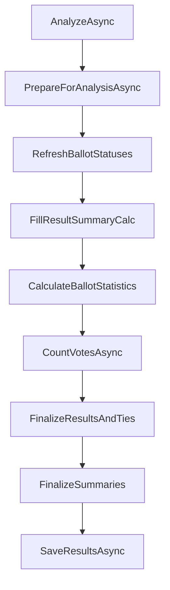

# Issue #168 Review: Core Election Analysis Engine

**Date:** June 17, 2026  
**Issue:** [#168 — Review & Validate Core Election Analysis Engine](https://github.com/glittle/TallyJ-4/issues/168)  
**Scope:** Review only — no code changes.

---

## Issue Goal & Checklist

**[#168](https://github.com/glittle/TallyJ-4/issues/168)** — Make the tallying and validation logic correct and trustworthy.

| Checklist item | Status |
|---|---|
| Review main analysis code/modules | Partially done (this review) |
| Side-by-side tests vs known-good v3 elections | **Not done** |
| Verify: valid/invalid ballots, spoiled votes, duplicates, "Name not in List", confidential voters, ties | **Unit tests only**; no v3 parity proof |
| Confirm final counts and reports match expectations | **Partially**; reports have query/workflow gaps |

---

## How the Engine Works Today

The analysis pipeline lives under `backend/Services/Analyzers/`:



### Key Classes

- **`ElectionAnalyzerBase`** — Orchestration, vote/ballot status refresh, statistics, tie detection, summary finalization
- **`BallotAnalyzer`** — Per-ballot rules (count, duplicates, verify, raw)
- **`ElectionAnalyzerNormal`** — Counts votes only from `BallotStatus.Ok` ballots with `VoteStatus.Ok` votes
- **`ElectionAnalyzerSingleName`** — Vote-level counting with `SingleNameElectionCount`
- **`TallyService`** — Entry point; creates the appropriate analyzer and exposes results/reports

**63 unit tests pass** across `ElectionAnalyzerNormalTests`, `ElectionAnalyzerSingleNameTests`, `BallotAnalyzerTests`, and `TallyServiceTests`.

---

## Checklist Comparison

### 1. Review Main Analysis Code — Mostly Solid Structure

**Working well:**

- Clear phased pipeline with DB transaction rollback on failure
- Prior results/ties cleared; tie-break counts preserved across re-runs via `_previousTieBreakCounts`
- Ranking: vote count → tie-break count → name sort key
- Sections E (elected) / X (extra) / O (other) assigned correctly
- Tie logic covers within-section ties, cross-boundary ties, `ForceShowInOther`, close-vote flags

**Weak / risky:**

- `BallotAnalyzer.DetermineVoteStatus()` exists but is **not used** in the live pipeline — `ElectionAnalyzerBase.DetermineVoteStatus()` is used instead. Two implementations can drift.
- Name resolution is **outside** the analyzer (ballot entry, import, online voting). Analyzer correctness assumes upstream data is already correct.

---

### 2. Side-by-Side v3 Tests — Major Gap

**Missing entirely:**

- No golden v3 election fixtures in the repo
- No automated "import v3 → tally v4 → compare to v3 expected output" tests
- `TallyJv3ElectionImportService` exists (`/api/Import/importTallyJv3Election`) but is not wired into regression tests
- `DashboardController.loadV3Election` still returns **501 Not Implemented**

This is the single largest unmet item in #168.

---

### 3a. Valid / Invalid Ballots — Good Unit Coverage; One Parity Question

**Working well:**

- Ballot statuses: `Ok`, `TooMany`, `TooFew`, `Dup`, `Empty`, `Verify`, `Raw`, `Review`
- `Review` is sticky (manual teller lock preserved)
- Ballot with all spoiled votes stays `Ok` (ballot accepted; votes discarded) — tested and matches expected v3-style behavior
- Name-change detection: vote `Changed` + ballot `Verify` → excluded from count, `BallotsNeedingReview` incremented

**Risky vs v3:**

- `BallotAnalyzer` counts **all vote rows** (including spoiled) for too-many / too-few / duplicate checks. A 2-slot ballot with 2 valid + 1 spoiled (U01) = 3 rows → `TooMany`. If v3 treated spoiled slots differently, results would diverge. **Not covered by tests.**

---

### 3b. Spoiled Votes — Working

- Votes spoiled when: person can't receive votes, person is null, or ineligible reason on vote
- Spoiled votes on valid ballots increment `SpoiledVotes` but are excluded from results
- Ineligible codes (U01, V01, X06, etc.) handled via `IneligibleReasonEnum` with v3-compatible GUIDs

---

### 3c. Duplicates — Working

- Same `PersonGuid` twice on one ballot → `BallotStatus.Dup`
- `TooMany` is checked before `Dup` (a ballot can be `TooMany` without reaching dup detection)

---

### 3d. "Name not in the List" — Handled Upstream, Not in Analyzer

- Not an analyzer concern directly: votes arrive as `PersonGuid = null` + `IneligibleReasonCode` (typically U01 Unidentifiable)
- Analyzer correctly spoils these and excludes them from counts
- **Name matching** happens at entry/import time (e.g. `CdnBallotImportService` matches by first+last name; unmatched names produce warnings, not votes)
- Online raw votes (`OnlineVoteRaw`, no `PersonGuid`) → `VoteStatus.Raw` → ballot `Raw` → needs teller resolution before counting

**Gap:** No end-to-end test proving the full "name not on list → teller resolves → tally" path matches v3.

---

### 3e. Confidential Voters — Not in Analysis Engine

- No analyzer logic for confidential voters
- Election has `MaskVotingMethod`, `ShowFullReport` (display/privacy settings) but these are not applied during tallying
- `Person.Flags` exists for attendance checklists, not confidentiality in results
- **Cannot verify #168 checklist item** from analyzer code alone — likely a reporting/display concern

---

### 3f. Ties & Tie-Breaks — Logic Strong; Workflow Broken

**Working well:**

- Extensive tie scenarios tested (within E, spanning E/X/O, tie-break resolution, `NumToElect` decrement)
- Tie-break counts influence final ordering when re-analysis runs
- `ResultTie` records with `IsResolved`, `TieBreakRequired`, `NumToElect`

**Critical workflow gap:**

In `TallyService.SaveTieCountsAsync`, when all ties in a group are resolved:

```csharp
// If all ties in a group are resolved, trigger re-analysis
if (reAnalysisNeeded)
{
    _logger.LogInformation("All ties resolved, triggering re-analysis for election {ElectionGuid}", electionGuid);
    // Note: In a real implementation, you might want to call CalculateNormalElectionAsync here
    // But for now, we'll just log it
}
```

`SaveTieCountsAsync` sets `reAnalysisTriggered: true` but **never re-runs the analyzer**. The frontend shows an info message and reloads tie details, but rankings don't update until someone manually runs Calculate Tally again. Tie-break resolution is effectively incomplete in the live workflow.

---

### 4. Final Counts and Reports — Partially Aligned

**Working well:**

- `ReportService.GetMainReportAsync` correctly filters `ResultType == "F"`
- `UseOnReports` gate checks: no ballots needing review, all ties resolved, envelope counts reconcile
- Normal analyzer summary math is internally consistent (tested)

**Gaps:**

- `TallyService.GetTallyStatisticsAsync` and `GetElectionReportAsync` use `FirstOrDefaultAsync` on `ResultSummaries` **without** filtering `ResultType == "F"` — can return the wrong summary when C/F/M rows coexist
- Some `TallyService` report helpers use simplified stubs (`HasOnlineBallot` as "voted", placeholder turnout data) — separate from analyzer but affects "reports match expectations"
- `ReportService` vs `TallyService` report paths may disagree on summary source

---

## Overall Assessment

The v4 analysis engine has a **well-structured port** of v3 tally logic with **strong unit-test coverage** for normal elections, spoilage, ballot validation, and complex tie scenarios. The core counting and tie-detection algorithms appear intentional and thoroughly tested at the unit level.

However, **issue #168 is not close to done**. There is **no v3 parity validation**, a **broken tie-break re-analysis workflow**, and several areas where behavior may diverge from v3 without anyone knowing (spoiled-vote slot counting, summary query bugs, name resolution happening outside the analyzer).

| Dimension | Confidence |
|---|---|
| Synthetic unit-test scenarios | Medium |
| Real-world v3 election parity | **Low** |

---

## Top 5 Gaps / Risks (Priority Order)

1. **No v3 side-by-side regression tests** — The #168 centerpiece. Without golden v3 elections, correctness is assumed, not proven.

2. **Tie-break save doesn't trigger re-analysis** — Users can enter tie-break counts but rankings/sections won't update automatically. `reAnalysisTriggered` is misleading.

3. **Name resolution is outside the analyzer** — Correct results depend on ballot entry, import, and online voting pipelines. A bug there won't be caught by analyzer unit tests.

4. **Duplicate vote-status logic** — `ElectionAnalyzerBase.DetermineVoteStatus` vs `BallotAnalyzer.DetermineVoteStatus` (static, tested but unused in pipeline). Drift risk.

5. **Summary/report query inconsistency** — `TallyService` may read the wrong `ResultSummary` row; report paths split between `ReportService` and `TallyService` with different completeness.

---

## Quick Wins (Low Effort, High Confidence)

| Win | Effort | Impact |
|---|---|---|
| Wire `SaveTieCountsAsync` to call `CalculateNormalElectionAsync` when ties resolve | ~5 lines | Fixes broken tie-break workflow |
| Filter `ResultSummaries` by `ResultType == "F"` in `TallyService` | ~3 lines | Fixes statistics/report bugs |
| Consolidate `DetermineVoteStatus` into one shared method | Small refactor | Prevents future drift |
| Add 2–3 v3 golden-file tests: import XML → tally → assert results JSON | Medium | Directly addresses #168 checklist item 2 |
| Add test for mixed valid+spoiled ballot (2 valid + 1 U01 on 2-slot ballot) | Small test | Clarifies v3 parity on slot counting |

---

## Recommended Next Steps for #168

1. **Build the v3 regression harness** — Import known-good v3 elections via `TallyJv3ElectionImportService`, run analyzer, compare `Results`, `ResultTies`, and `ResultSummary` (type F) to exported v3 snapshots.
2. **Fix tie-break re-analysis** — Make save → re-tally automatic (backend + confirm frontend refreshes results).
3. **Document / test the spoiled-vote slot-counting rule** — Confirm with a real v3 election whether spoiled rows count toward too-many/too-few.
4. **Trace confidential voter handling** — Determine if this is analyzer scope or report/display scope, then add targeted tests.
5. **Run the quick wins above** before deeper v3 comparison work.

---

## Files Reviewed

| Path | Role |
|---|---|
| `backend/Services/Analyzers/ElectionAnalyzerBase.cs` | Core orchestration and tie logic |
| `backend/Services/Analyzers/ElectionAnalyzerNormal.cs` | Normal election vote counting |
| `backend/Services/Analyzers/ElectionAnalyzerSingleName.cs` | Single-name election counting |
| `backend/Services/Analyzers/BallotAnalyzer.cs` | Ballot-level validation |
| `backend/Services/TallyService.cs` | Tally entry point, reports, tie-break save |
| `backend/Services/ReportService.cs` | Main report generation |
| `Backend.Tests/UnitTests/ElectionAnalyzerNormalTests.cs` | Normal analyzer tests |
| `Backend.Tests/UnitTests/ElectionAnalyzerSingleNameTests.cs` | Single-name analyzer tests |
| `Backend.Tests/UnitTests/BallotAnalyzerTests.cs` | Ballot analyzer tests |
| `Backend.Tests/UnitTests/TallyServiceTests.cs` | Tally service integration tests |